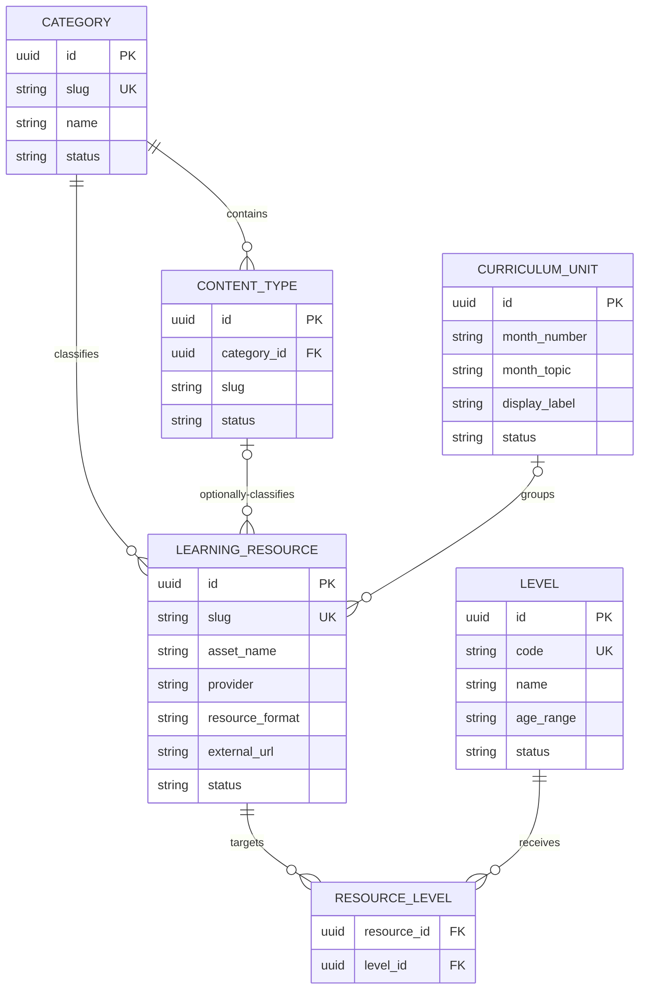

# Angel Kids Learning Hub — Data Schema

**Version:** 1.0  
**Applies to:** MVP public Learning Hub  
**Database:** PostgreSQL 16  
**ORM:** Prisma (recommended)

## 1. Purpose and scope

This document is the source of truth for the MVP database schema and content-data rules.

It supports only the public Angel Kids Learning Hub:

- Categories and Content Types.
- Levels and Curriculum Units.
- Learning Resources delivered by YouTube, Heyzine, or Google Drive.
- Public resource discovery by Level, Product Name, and Curriculum Unit.

It does **not** introduce accounts, students, classes, teacher workflows, outcomes, skill lines, assignments, progress tracking, analytics, admin UI, FastAPI, queues, or media storage. Those require a separate approved schema extension later.

`PRD.md` defines product behaviour. `design.md` defines presentation. This file defines the data that makes that behaviour possible.

## 2. Core principles

1. **Angel Kids owns the displayed metadata.** `assetName`, Levels, Curriculum Unit, thumbnail, alt text, and publication status are stored by Angel Kids.
2. **Providers only deliver content.** YouTube, Heyzine, and Google Drive URLs must not automatically provide visible title, description, dates, tags, or filters.
3. **Learning Resources are records, not hard-coded cards.** A new resource is added as data and automatically appears in the correct existing listing.
4. **A Curriculum Unit is Month + Topic.** A month can have many topics; never enforce one topic per month.
5. **Levels are many-to-many.** A Learning Resource can serve one or multiple Levels.
6. **Archive rather than delete referenced curriculum data.** Preserve historical records and prevent broken links.
7. **No durable content files live in the app container.** The database stores metadata and URLs only.

## 3. Entity relationship map



## 4. Global conventions

| Convention | Rule |
|---|---|
| Primary key | UUID generated by PostgreSQL/Prisma. Do not expose sequential IDs publicly. |
| Time | `createdAt` and `updatedAt` use timezone-aware timestamps. |
| Text | Use UTF-8; Vietnamese and English are both valid. |
| URLs | Store full HTTPS URLs only. Validate provider domain before an item can become `ACTIVE`. |
| Ordering | Lower `sortOrder` appears first. Use increments of 10 to allow later insertion. |
| Public visibility | Only `ACTIVE` records are returned by public queries. |
| Delete policy | Reference data is archived; no physical delete while referenced by a resource. |
| Slug | Lowercase route-safe ASCII slug, generated from Asset Name and editable only when needed. |

### Standard status enum

```text
DRAFT     = prepared internally; never public
ACTIVE    = visible in public Learning Hub
ARCHIVED  = retained for history; never public
```

All five core entities use this same status vocabulary. The public application must query `status = ACTIVE` for every entity in the path.

## 5. Enums

### 5.1 Provider

```text
YOUTUBE
HEYZINE
GOOGLE_DRIVE
```

### 5.2 Resource Format

```text
ANIMATED_STORY_VIDEO
ANIMATED_DIALOGUE_VIDEO
LEARNING_SONG_VIDEO
SCHOOL_SONG_VIDEO
DIGITAL_STORYBOOK
DIGITAL_DIALOGUE_BOOK
DIGITAL_FLASHCARD_SET
PRINT_AND_PLAY_COLLECTION
```

## 6. Tables

### 6.1 `categories`

Represents the five fixed top-level Learning Hub categories.

| Field | PostgreSQL / Prisma type | Required | Rule |
|---|---|---:|---|
| `id` | UUID | Yes | Primary key. |
| `slug` | varchar(80) | Yes | Globally unique; used for category routing/configuration. |
| `name` | varchar(100) | Yes | Angel Kids label, for example `Watch`. |
| `description` | varchar(280) | Yes | Short card description. |
| `illustrationUrl` | text | Yes | School-controlled card illustration/asset path. |
| `sortOrder` | integer | Yes | Default 10, 20, 30… |
| `status` | Status enum | Yes | Default `ACTIVE`. |
| `createdAt` | timestamptz | Yes | Creation audit time. |
| `updatedAt` | timestamptz | Yes | Last change audit time. |

Seeded records:

| slug | name | sortOrder |
|---|---|---:|
| `watch` | Watch | 10 |
| `read` | Read | 20 |
| `songs` | Songs | 30 |
| `digital-flashcards` | Digital Flashcards | 40 |
| `print-and-plays` | Print and Plays | 50 |

### 6.2 `content_types`

Represents the fixed second navigation level that exists only under Watch and Read in MVP.

| Field | PostgreSQL / Prisma type | Required | Rule |
|---|---|---:|---|
| `id` | UUID | Yes | Primary key. |
| `categoryId` | UUID | Yes | FK → `categories.id`. |
| `slug` | varchar(80) | Yes | Unique within one Category. |
| `name` | varchar(100) | Yes | Angel Kids label. |
| `description` | varchar(280) | Yes | Short content-type card description. |
| `illustrationUrl` | text | Yes | School-controlled illustration/asset path. |
| `sortOrder` | integer | Yes | Default 10, 20… |
| `status` | Status enum | Yes | Default `ACTIVE`. |
| `createdAt` | timestamptz | Yes | Creation audit time. |
| `updatedAt` | timestamptz | Yes | Last change audit time. |

Seeded records:

| Parent Category | slug | name | sortOrder |
|---|---|---|---:|
| Watch | `stories` | Stories | 10 |
| Watch | `dialogues` | Dialogues | 20 |
| Read | `storybooks` | Storybooks | 10 |
| Read | `dialogue-books` | Dialogue Books | 20 |

### 6.3 `levels`

Represents the teaching level/age band, not a class, student, or account.

| Field | PostgreSQL / Prisma type | Required | Rule |
|---|---|---:|---|
| `id` | UUID | Yes | Primary key. |
| `code` | varchar(30) | Yes | Globally unique stable code, for example `L4`. |
| `name` | varchar(80) | Yes | Display name, for example `Level 4`. |
| `ageRange` | varchar(80) | No | Display range, for example `4-5 years`. |
| `sortOrder` | integer | Yes | Defines filter and badge order. |
| `status` | Status enum | Yes | Default `ACTIVE`. |
| `createdAt` | timestamptz | Yes | Creation audit time. |
| `updatedAt` | timestamptz | Yes | Last change audit time. |

Initial Angel Kids curriculum data may seed `L3`, `L4`, and `L5`. The schema intentionally permits future Level records without code changes.

### 6.4 `curriculum_units`

A Curriculum Unit is a user-facing Month + Topic combination.

| Field | PostgreSQL / Prisma type | Required | Rule |
|---|---|---:|---|
| `id` | UUID | Yes | Primary key. |
| `monthNumber` | char(2) | Yes | `01` through `12`, including leading zero. |
| `monthTopic` | varchar(220) | Yes | Topic text, for example `Trường học \| Chào năm học mới`. |
| `displayLabel` | varchar(260) | Yes | Full displayed label, for example `09 - Trường học \| Chào năm học mới`. |
| `sortOrder` | integer | Yes | Curriculum display order. |
| `status` | Status enum | Yes | Default `ACTIVE`. |
| `createdAt` | timestamptz | Yes | Creation audit time. |
| `updatedAt` | timestamptz | Yes | Last change audit time. |

**Constraints:**

- `monthNumber` must match `^(0[1-9]|1[0-2])$`.
- Do not use a unique constraint on `monthNumber`.
- Use a unique constraint on the pair `(monthNumber, monthTopic)` to prevent accidental duplicate topic records in the same month.
- `displayLabel` is stored, not assembled exclusively in the UI, so the school can control bilingual/brand wording.

### 6.5 `learning_resources`

One record equals one card/product in the Learning Hub. It stores Angel Kids metadata plus the destination URL for the approved external provider.

| Field | PostgreSQL / Prisma type | Required | Rule |
|---|---|---:|---|
| `id` | UUID | Yes | Primary key. |
| `slug` | varchar(160) | Yes | Globally unique public identifier for video detail routes. Keep stable after publication. |
| `assetName` | varchar(200) | Yes | Product title displayed on the card and detail page. Never import provider title automatically. |
| `description` | varchar(500) | No | Optional school-authored supporting copy; not required on product cards. |
| `categoryId` | UUID | Yes | FK → `categories.id`. |
| `contentTypeId` | UUID | No | FK → `content_types.id`; required only for Watch/Read formats. |
| `curriculumUnitId` | UUID | No | FK → `curriculum_units.id`; may be null only for a School Song when deliberately not curriculum-linked. |
| `provider` | Provider enum | Yes | `YOUTUBE`, `HEYZINE`, or `GOOGLE_DRIVE`. |
| `resourceFormat` | ResourceFormat enum | Yes | Defines accepted route, card ratio, and delivery treatment. |
| `externalUrl` | text | Yes | Validated provider destination URL; never exposed as unrelated user input. |
| `thumbnailUrl` | text | No | Angel Kids card thumbnail. Required before `ACTIVE` except a verified future official Heyzine-cover integration. |
| `altText` | varchar(250) | Yes | Meaningful thumbnail description for assistive technology. |
| `status` | Status enum | Yes | Default `DRAFT`; public only when `ACTIVE`. |
| `sortOrder` | integer | Yes | Default 100; manual editorial ordering within a listing. |
| `createdAt` | timestamptz | Yes | Creation audit time. |
| `updatedAt` | timestamptz | Yes | Last change audit time. |

### 6.6 `resource_levels`

Join table that permits one Learning Resource to serve one or many Levels.

| Field | PostgreSQL / Prisma type | Required | Rule |
|---|---|---:|---|
| `resourceId` | UUID | Yes | FK → `learning_resources.id`. |
| `levelId` | UUID | Yes | FK → `levels.id`. |

**Primary key:** composite `(resourceId, levelId)`.

This prevents the same Level being attached twice to the same Learning Resource.

## 7. Valid resource combinations

The application validates the following matrix before activating a Learning Resource.

| Resource Format | Category | Content Type | Provider | Curriculum Unit | Card ratio | Open behaviour |
|---|---|---|---|---|---|---|
| `ANIMATED_STORY_VIDEO` | Watch | Stories, required | YouTube | Required | 16:9 | Video detail page |
| `ANIMATED_DIALOGUE_VIDEO` | Watch | Dialogues, required | YouTube | Required | 16:9 | Video detail page |
| `LEARNING_SONG_VIDEO` | Songs | Null | YouTube | Required | 16:9 | Video detail page |
| `SCHOOL_SONG_VIDEO` | Songs | Null | YouTube | Optional | 16:9 | Video detail page |
| `DIGITAL_STORYBOOK` | Read | Storybooks, required | Heyzine | Required | 16:9 | Heyzine reader dialog |
| `DIGITAL_DIALOGUE_BOOK` | Read | Dialogue Books, required | Heyzine | Required | 16:9 | Heyzine reader dialog |
| `DIGITAL_FLASHCARD_SET` | Digital Flashcards | Null | Heyzine | Required | 3:4 | Heyzine reader dialog |
| `PRINT_AND_PLAY_COLLECTION` | Print and Plays | Null | Google Drive | Required | 16:10 | Open Drive folder in new tab |

### Validation rules that require application-level validation

Relational foreign keys cannot fully validate the matrix above. Use Zod in the controlled data import/write path to enforce these rules:

- A `contentTypeId`, when supplied, must belong to the selected `categoryId`.
- `ANIMATED_STORY_VIDEO` must point to the active Watch → Stories Content Type.
- `ANIMATED_DIALOGUE_VIDEO` must point to the active Watch → Dialogues Content Type.
- `DIGITAL_STORYBOOK` must point to the active Read → Storybooks Content Type.
- `DIGITAL_DIALOGUE_BOOK` must point to the active Read → Dialogue Books Content Type.
- Song, Flashcard, and Print and Play formats require `contentTypeId = null` in MVP.
- A resource may only become `ACTIVE` if all linked Category, Content Type (if applicable), Level(s), and Curriculum Unit (if applicable) are `ACTIVE`.
- Each `ACTIVE` Learning Resource must have at least one active Level.
- `thumbnailUrl` is mandatory for each active resource in the current MVP workflow.

## 8. External URL validation

Validate URLs on the server before changing a record to `ACTIVE`.

| Provider | Accepted host rule | Expected use |
|---|---|---|
| YouTube | `youtube.com`, `www.youtube.com`, `youtu.be`, `www.youtube-nocookie.com` | Video source; normalise to a safe embed URL only at render time. |
| Heyzine | Exact Heyzine public-reader host(s) verified by the current school account | Embed inside the reader dialog. |
| Google Drive | `drive.google.com` folder URL | Open in a new browser tab. |

General rules:

- Only `https:` URLs are accepted.
- Reject embedded JavaScript, data URLs, file URLs, URL shorteners not explicitly approved, and hostnames that merely contain an approved provider name.
- Do not scrape provider pages for metadata.
- Store the original approved external URL; derive presentation URLs only in server-side helpers.

## 9. Prisma model reference

This is the intended relational structure. Exact Prisma syntax may be adapted to the installed Prisma version, but relationships, constraints, names, and rules must be preserved.

```prisma
enum Status {
  DRAFT
  ACTIVE
  ARCHIVED
}

enum Provider {
  YOUTUBE
  HEYZINE
  GOOGLE_DRIVE
}

enum ResourceFormat {
  ANIMATED_STORY_VIDEO
  ANIMATED_DIALOGUE_VIDEO
  LEARNING_SONG_VIDEO
  SCHOOL_SONG_VIDEO
  DIGITAL_STORYBOOK
  DIGITAL_DIALOGUE_BOOK
  DIGITAL_FLASHCARD_SET
  PRINT_AND_PLAY_COLLECTION
}

model Category {
  id               String             @id @default(uuid()) @db.Uuid
  slug             String             @unique @db.VarChar(80)
  name             String             @db.VarChar(100)
  description      String             @db.VarChar(280)
  illustrationUrl  String             @db.Text
  sortOrder        Int                @default(100)
  status           Status             @default(ACTIVE)
  createdAt        DateTime           @default(now()) @db.Timestamptz(6)
  updatedAt        DateTime           @updatedAt @db.Timestamptz(6)
  contentTypes     ContentType[]
  resources        LearningResource[]
}

model ContentType {
  id               String             @id @default(uuid()) @db.Uuid
  categoryId       String             @db.Uuid
  slug             String             @db.VarChar(80)
  name             String             @db.VarChar(100)
  description      String             @db.VarChar(280)
  illustrationUrl  String             @db.Text
  sortOrder        Int                @default(100)
  status           Status             @default(ACTIVE)
  createdAt        DateTime           @default(now()) @db.Timestamptz(6)
  updatedAt        DateTime           @updatedAt @db.Timestamptz(6)
  category         Category           @relation(fields: [categoryId], references: [id], onDelete: Restrict)
  resources        LearningResource[]

  @@unique([categoryId, slug])
  @@index([categoryId, status, sortOrder])
}

model Level {
  id               String          @id @default(uuid()) @db.Uuid
  code             String          @unique @db.VarChar(30)
  name             String          @db.VarChar(80)
  ageRange         String?         @db.VarChar(80)
  sortOrder        Int             @default(100)
  status           Status          @default(ACTIVE)
  createdAt        DateTime        @default(now()) @db.Timestamptz(6)
  updatedAt        DateTime        @updatedAt @db.Timestamptz(6)
  resourceLevels   ResourceLevel[]
}

model CurriculumUnit {
  id               String             @id @default(uuid()) @db.Uuid
  monthNumber      String             @db.Char(2)
  monthTopic       String             @db.VarChar(220)
  displayLabel     String             @db.VarChar(260)
  sortOrder        Int                @default(100)
  status           Status             @default(ACTIVE)
  createdAt        DateTime           @default(now()) @db.Timestamptz(6)
  updatedAt        DateTime           @updatedAt @db.Timestamptz(6)
  resources        LearningResource[]

  @@unique([monthNumber, monthTopic])
  @@index([status, sortOrder])
}

model LearningResource {
  id               String             @id @default(uuid()) @db.Uuid
  slug             String             @unique @db.VarChar(160)
  assetName        String             @db.VarChar(200)
  description      String?            @db.VarChar(500)
  categoryId       String             @db.Uuid
  contentTypeId    String?            @db.Uuid
  curriculumUnitId String?            @db.Uuid
  provider         Provider
  resourceFormat   ResourceFormat
  externalUrl      String             @db.Text
  thumbnailUrl     String?            @db.Text
  altText          String             @db.VarChar(250)
  status           Status             @default(DRAFT)
  sortOrder        Int                @default(100)
  createdAt        DateTime           @default(now()) @db.Timestamptz(6)
  updatedAt        DateTime           @updatedAt @db.Timestamptz(6)
  category         Category           @relation(fields: [categoryId], references: [id], onDelete: Restrict)
  contentType      ContentType?       @relation(fields: [contentTypeId], references: [id], onDelete: Restrict)
  curriculumUnit   CurriculumUnit?    @relation(fields: [curriculumUnitId], references: [id], onDelete: Restrict)
  levels           ResourceLevel[]

  @@index([categoryId, contentTypeId, status, sortOrder])
  @@index([curriculumUnitId, status, sortOrder])
  @@index([status, resourceFormat, sortOrder])
}

model ResourceLevel {
  resourceId       String            @db.Uuid
  levelId          String            @db.Uuid
  resource         LearningResource  @relation(fields: [resourceId], references: [id], onDelete: Cascade)
  level            Level             @relation(fields: [levelId], references: [id], onDelete: Restrict)

  @@id([resourceId, levelId])
  @@index([levelId, resourceId])
}
```

## 10. Public query rules

### 10.1 Public listing

For any resource listing page:

1. Select only `LearningResource.status = ACTIVE`.
2. Require `Category.status = ACTIVE`.
3. If the route includes a Content Type, require matching `ContentType.status = ACTIVE`.
4. Include only active Levels through `ResourceLevel`.
5. Include an active Curriculum Unit when the resource has one.
6. Sort by `sortOrder ASC`, then `assetName ASC`.
7. Return only Hub-owned UI fields and the validated destination URL needed for rendering.

### 10.2 Filter behaviour

The page loads its scoped active resources once, then filters client-side:

```text
matchesLevel
AND matchesAssetName
AND matchesCurriculumUnit
```

- **Level:** a resource matches if any attached active Level equals the selected Level.
- **Product Name:** case-insensitive partial search against `assetName` only.
- **Curriculum Unit:** exact match on `curriculumUnitId`.
- **All / blank values:** do not restrict the corresponding filter.
- Filter option lists are derived from the active resources on the current page, not from inactive records or external providers.

### 10.3 Public data shape

The browser should receive a deliberately small DTO, for example:

```ts
type PublicResource = {
  slug: string;
  assetName: string;
  categorySlug: string;
  contentTypeSlug: string | null;
  resourceFormat: ResourceFormat;
  provider: Provider;
  externalUrl: string;
  thumbnailUrl: string | null;
  altText: string;
  levels: Array<{ code: string; name: string; sortOrder: number }>;
  curriculumUnit: { id: string; displayLabel: string; sortOrder: number } | null;
};
```

The DTO must not include `DATABASE_URL`, raw provider metadata, unpublished content, or internal audit fields.

## 11. Controlled resource-addition input

Every new resource must be entered/reviewed with this complete structured brief:

```text
Category:
Content Type: (null when not applicable)
Resource Format:
Asset Name:
Slug:
Level(s):
Curriculum Unit: (null only for a deliberately non-curriculum School Song)
Provider:
External URL:
Thumbnail URL / supplied asset:
Alt text:
Status: DRAFT or ACTIVE
Sort order:
```

Before publication, the controlled import/update workflow must validate the record against Sections 7 and 8, then create or update it through Prisma. It must never modify a page component just to add one resource.

## 12. Archive, delete, and change rules

- Change a resource to `ARCHIVED` to remove it from public listings while retaining it for history.
- Do not delete a Category, Content Type, Level, or Curriculum Unit referenced by any resource. Change its status to `ARCHIVED` only after all relevant public resources are archived or reassigned.
- Do not change a published video slug unless a redirect strategy is deliberately introduced. Existing parent/teacher links may depend on it.
- Changing a resource from `ACTIVE` to `DRAFT` or `ARCHIVED` hides it immediately from public queries.
- Change `externalUrl` only after revalidating provider host and confirming the target opens correctly.
- Changing `thumbnailUrl` or `altText` affects only Hub presentation; it must not alter data from the external provider.

## 13. Migration and seed order

1. Create enums: `Status`, `Provider`, `ResourceFormat`.
2. Create `categories`, `content_types`, `levels`, and `curriculum_units`.
3. Create `learning_resources` and `resource_levels` with foreign keys and indexes.
4. Seed five Categories.
5. Seed four Content Types under their correct Categories.
6. Seed current school Levels and Curriculum Units.
7. Add initial Learning Resources as `DRAFT`, validate them, then explicitly activate approved records.

Never seed prototype visual card text as active school content.

## 14. Schema acceptance checklist

- [ ] One month can contain multiple Curriculum Units/topics.
- [ ] One Learning Resource can have multiple Levels without duplicated join rows.
- [ ] An active resource cannot point to an inactive/archived parent reference.
- [ ] Story, Dialogue, Song, Storybook, Dialogue Book, Flashcard, and Print and Play records validate against the allowed matrix.
- [ ] Public listing queries exclude all `DRAFT` and `ARCHIVED` data.
- [ ] Card text and filters use only `assetName`, Level, and Curriculum Unit stored by Angel Kids.
- [ ] Provider URLs are validated before a resource becomes active.
- [ ] Deleting referenced curriculum records is prevented; archiving remains available.
- [ ] Indexes cover current listing, Level-filter, Curriculum Unit-filter, and video-slug lookup paths.

## 15. Explicitly deferred schema extensions

Do not add these tables during MVP unless a new approved requirement demands them:

- `users`, `students`, `parents`, `teachers`, `classes`, `enrollments`, `assignments`, `progress_events`, `reports`.
- `skill_lines`, `outcomes`, and outcome-resource mapping.
- Admin audit-log tables and in-app publishing workflow.
- Provider API cache, analytics events, favourites, search history, or recommendation tables.
- Multi-school tenancy fields such as `schoolId`.

When any of these becomes necessary, create a versioned schema extension document and migration plan rather than modifying the MVP schema informally.
